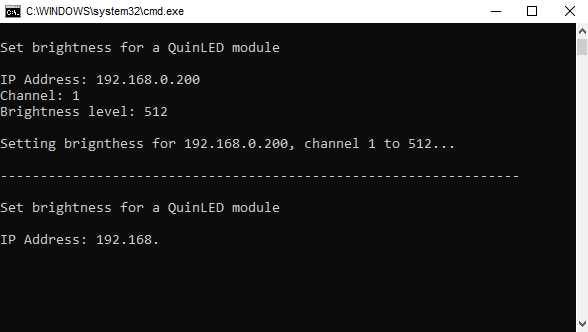

# Batch file
This batch file allows you to quickly test new QuinLED modules, or simply control them through a command line interface, without having to remember the exact command syntax.

Simply download [`QuinLED QuickSet.bat`](QuinLED%20QuickSet.bat) and double click it to run.
