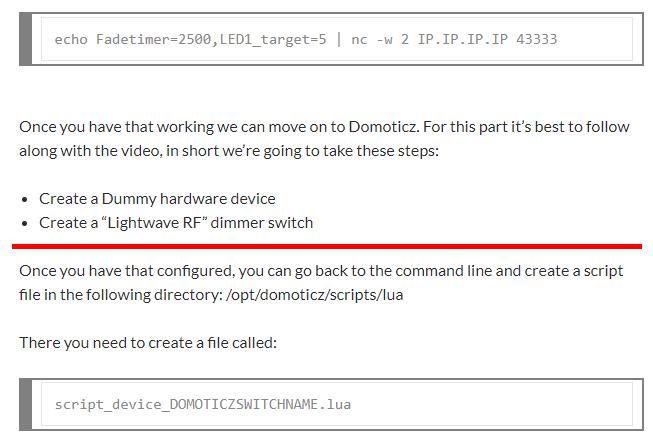
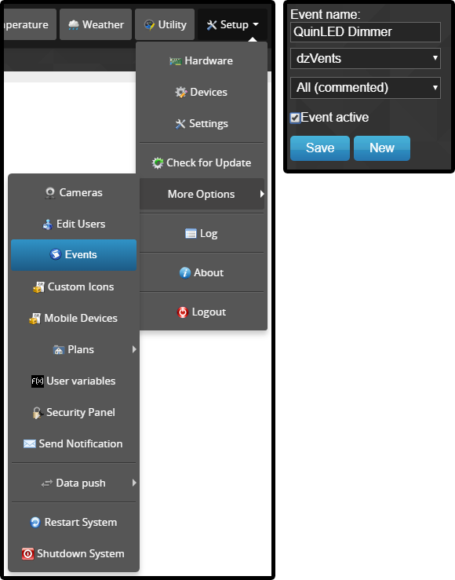
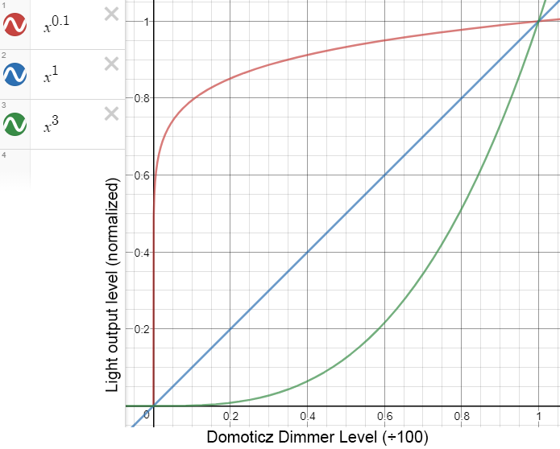

# Domoticz
This completely replaces [this article](http://blog.quindorian.org/2017/02/esp8266-led-lighting-using-quinled-with-domoticz.html/), from the red line onwards. Please follow the linked article until the red line (so create the dummy hardware and the dimmer switch), then follow this guide.

For more information about dzVents, please refer to [this amazingly detailed Domoticz Wiki page](https://www.domoticz.com/wiki/DzVents:_next_generation_LUA_scripting).

<p align="center"></p>

This section is optional. You can also just follow Quindor's approach, but I personally think using my method is a lot easier.

Since I personally have been using dzVents for all my custom scripts in Domoticz, I'll explain to you how you can use these. I personally think dzVents is much easier and more flexible to use, and it can all be done from the browser, no need for the commandline.
An important thing to note: I'm not 100% sure that dzVents is already implemented in Domoticz by default. If it isn't, you may need to switch over to the beta version of Domoticz.
  
You can enter the browser's text editor by clicking `Setup > More Options > Events`. On the right side of the screen, enter an Event name, click the box that says `Blockly`, select `dzVents`, and click `New`. You can leave the third box alone, it doesn't matter for our use. I'd suggest also enabling the `Event active` checkbox, and clicking `Save`. Please be aware that this editor does not automatically save. If you close the tab or move between scripts, your changes are lost. It won't even show you a notification warning you that you are about to lose our changes, so be sure to save often.

Now you've got the editor open, select all text and delete it. Now go to either the [QuinLED Dimmer](QuinLED%20Dimmer.lua) or the [QuinLED Switch](QuinLED%20Switch.lua) script, copy the entire contents, and paste it in the web editor. Don't forget to save!
Just to clarify, the QuinLED Switch is a version of the QuinLED Dimmer, that can only toggle between 0 and 1023 (maximum). This pretty much converts the QuinLED dimmer into a QuinLED relay. Not very optimal, but it may have its uses.

<p align="center"></p>

Now you need to make one small change to the file. You only need to understand one thing about these dzVents scripts. They run based on the names that you enter in the `devices` table. For example, the section below would automatically run when `QuinLED Dimmer1` or `QuinLED Dimmer2` have their values changed, but it wouldn't work for `QuinLED Dimmer3`, or even for `QuinLED dimmer1`. These names need to be exactly the same as the dimmer switch in Domoticz.
```lua
	on = {
		devices = {
			'QuinLED Dimmer1',
			'QuinLED Dimmer2',
		},
	},
```

Therefor, it's imperative that you change these names to match your dimmer devices. It doesn't matter what they're called, as long as the dimmer name matches the text in the dzVents script. If you followed Quindor's tutorial exactly, you'll want to change the section above to this:

```lua
	on = {
		devices = {
			'TestDimmer',
		},
	},
```

Make sure that if you add new lines, that they always end with a comma. If you are encountering issues you can't explain, try uncommenting line 15 (`level = domoticz.LOG_DEBUG`) and commenting out line 16 (`level = domoticz.LOG_ERROR`), and then check the Domoticz log. It may contain some errors.

## Global Data
You might be wondering: "How does Domoticz know the IP addresses of my QuinLED modules? Can it do magic?". Unfortunately, it can't, but it's not far off. Instead of coding the IP addresses and all other variables into the script, I decided to use something called "global data". This basically is a database that contains variables that can be accessed from any dzVents script, instead of being limited to one.

If you don't have this global data database yet, simply create another new dzVents script, and name it `global_data`. Again, this name is case-sensitive, so it's very important that you enter exactly the right name.

For the contents of the `global_data` script, please refer to the [`global_data.lua`](global_data.lua). You can paste this into the empty `global_data` script in Domoticz. You do need to edit this file though, so I'll explain it here:

```lua
QL_COMMAND = "echo Fadetimer=%d, LED%d_target=%d | nc -w %d %s %s &",

QL_PORT = "43333",
QL_RESOLUTION = 1023,
QL_TIMEOUT = 1,
```

These four variables should probably be the same for all your QuinLED modules. 
- `QL_COMMAND` should never be changed. This is the template for every command sent from Domoticz to your QuinLED modules.
- `QL_PORT` should always be 43333, unless you changed this yourself. If you don't know if you changed it, you didn't.
- `QL_RESOLUTION` refers to the number of dimming steps. Unless you changed this yourself, it should always be 1023.
- `QL_TIMEOUT` refers to the maximum number of seconds a QuinLED module may take to respond to domoticz before it times out. If your devices are in an area with bad WiFi coverage, and they only respond sometimes, it may be wise to increase this number. For normal use, 1 should be fine.

```lua
-- Linking switch name to global_data identifier
--   REQUIRED
QL_NAME = {
    ["QuinLED Dimmer1"] = "DIMMER1",
    ["QuinLED Dimmer2"] = "DIMMER2",
},
```

This section may be a bit confusing, but it basically links the name of the dimmer switch in Domoticz (TestDimmer if you followed along with Quindor) to an internal name, so that if you change your dimmer switch's name, you only have to change it once here (plus you can give it a name that's easier to work with). Basically, the name you gave the switch in Domoticz (TestDimmer) should be on the left, and the internal name, which can be anything, should be on the right.

```lua
-- IP address (String)
--  REQUIRED
QL_IP = {
    DIMMER1 = "192.168.0.200",
    DIMMER2 = "192.168.0.200",
},

-- Output channel (Integer)
--  REQUIRED
QL_CHANNEL = {
    DIMMER1 = 1,
    DIMMER2 = 2,
},

-- Fadetime (Integer) [ms]
--  Enables you to set a custom fadetime per device.
--  When an entry is missing, or is set to nil, the script will use the default value of zero.
QL_FADETIME = {
    DIMMER1 = 0,
    DIMMER2 = 0,
},
```

These values should be pretty self explanatory, but basically they contain the IP address, channel, and fadetime for each dimmer switch you made. In this example, you can see thta `QuinLED Dimmer1` and `QuinLED Dimmer2` are both on the same QuinLED module, just on different channels, and they both change instantly (so a fadetime of zero).

```lua
-- Fadetime override (Integer) [ms]
-- 	Enables you to (temporarilly) override the fadetime per device.
--  When an entry is missing, or is set to nil, nothing will be overridden.
QL_FADETIME_OVERRIDE = {
    DIMMER1 = nil,
    DIMMER2 = nil,
},
```

Fadetime override is a functionality that is probably best used from inside other scripts. For example, you normally want your light to turn on instantly, so you have the fadetime set to zero. However, you also want to use it as a wake-up light, where it very slowly gets brighter. Here you could have another script first set the fadetime override to a value like 300 (five minutes), then have it turn the lamp on, and then reset the fadetime override to nil, so it won't interfere with normal usage.

```lua
-- Resolution override (Integer) [ms]
--	Enables you to set a maximum dimming level per device.
--  When an entry is missing, or is set to nil, the script will use the default resolution value.
QL_RESOLUTION_OVERRIDE = {
    DIMMER1 = nil,
    DIMMER2 = nil,
},
```

Resolution override is a functionality that allows you to set a custom 'maximum brightness' for every dimmer device. Each of your QuinLED modules can dim in a range from 0 to 1023 (10 bits), but you may want some of your lights to be a bit less bright. Here you can set any value (between 0 and 1023), which will then be the new maximum brightness of that specific light.

```lua
-- Resolution ramping (Float) (x^y, where y is defined in the QL_RESOLUTION_RAMP table below)
-- Accepted values: Anything greater than zero.
-- Recommended values: Anything between zero and five.

-- For a visualisation of the dimming curve, go to https://www.desmos.com/calculator (or any other graphical calculator),
-- and enter 'x^y' as the formula, where y is the number you enter in this table.
-- When there is no entry for a device, x^1 is used, which results in a straight line.

-- (0 < y < 1) results in a more 'agressive' dimming (gets brighter earlier, fine-tuning in the end)
-- (1) results in a linear dimming.
-- (1 < y < inf.) results in a more 'relaxed' dimming (fine-tuning in the beginning, gets brighter quickly at the end)
QL_RESOLUTION_RAMP = {
    DIMMER1 = 1.2,
    DIMMER2 = 2,
},
```

Resolution ramping is the most complex functionality so far. It allows you to have a custom dimming curve for each QuinLED module. The comment in the code above should give you a pretty good idea of how it works. In the image below you can see some dimming ramps. The X-axis represents the percentage set on your dimmer in Domoticz (0-1 represents 0 to 100 percent), and the Y-axis represents the actual output of your light (0-1 represents 0-1023).

In the image below, you can see how a ramp value of 0.1 makes the light get bright very early in the dimming phase, already being at 80% of its maximum output when the dimmer in Domoticz is set to just 10%. On the other hand, a ramp value of 3 makes the light get brighter very slowly, outputing just over 50% of its maximum output when the dimmer in Domoticz is set to 80%. A ramp value of 1 represents the normal behaviour of the dimmer.

An important thing to note here, is that no matter the ramp value, when the Domoticz dimmer is at 0%, the light will output nothing, and when the Domoticz dimmer is at 100%, the light will output at 100%.

<p align="center"></p>