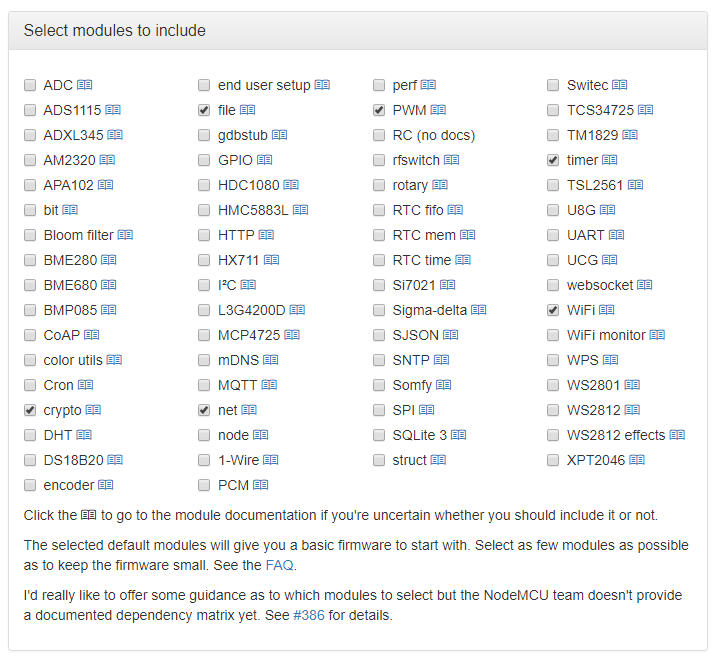

# NodeMCU Firmware
This replaces the `.bin` file provided in the `Firmware flashing` folder, as referenced in [this article](http://blog.quindorian.org/2016/09/esp8266-led-lighting-setting-voltage-and-flashing-nodemcu.html/), and [this video](https://www.youtube.com/watch?v=wFEgjiDkVds). If you just want a working firmware, either use the `nodemcu-master-9-modules-2016-07-21-20-12-04-integer.bin` file provided by Quindor, or the `nodemcu-master-6-modules-2018-05-18-18-09-02-integer.bin` file provided [here](nodemcu-master-6-modules-2018-05-18-18-09-02-integer.bin).

If you want to compile your own firmware, to have a more recent version, or to add different modules for your own use, I'd suggest using [NodeMCU Build (nodemcu-build.com)](https://nodemcu-build.com). This does require an active email address, but in my experience, they only send you an email to inform you that your build has started or completed.

If you do decide to compile your own firmware, make sure to include at least the `crypto`, `file`, `net`, `pwm`, `sjson`, `tmr` and `wifi` modules. I'm not 100% sure the `crypto` and `sjson` modules are actually required, this still requires some testing, but for now I'd advise to include them.

Notes:
- None of theMiscellaneous options need to be checked
- After clicking the 'Start your build' button, it can take some time before you get an email saying your build has started. Please be patient.
