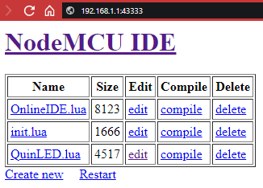
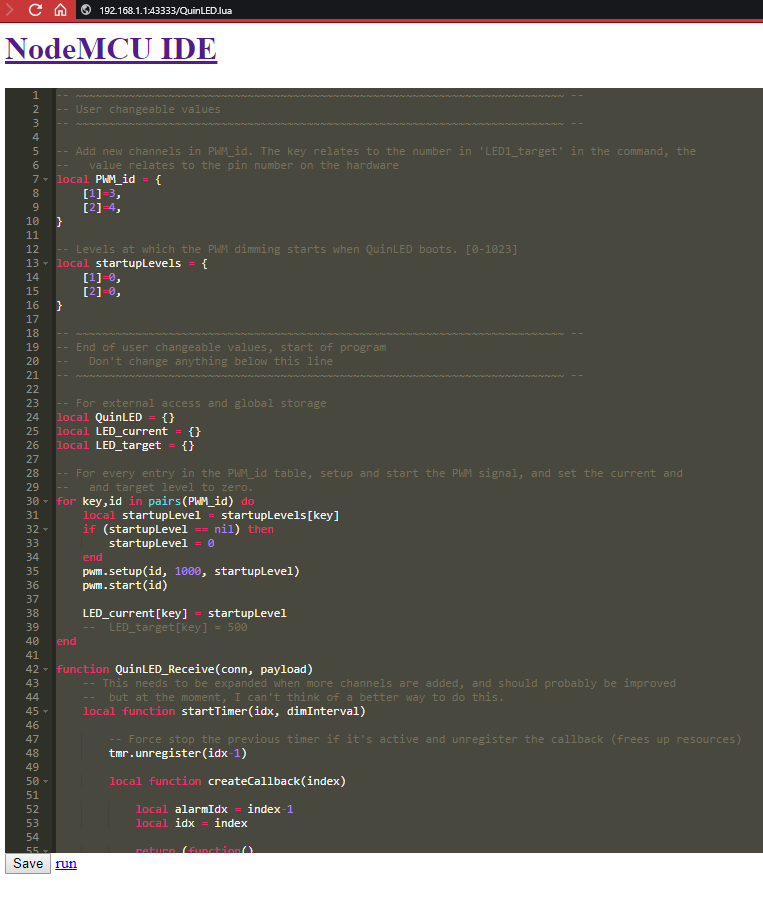

# Program Code
This replaces the Lua code provided in [this article](http://blog.quindorian.org/2017/01/esp8266-led-lighting-programming-and-controlling-quinled.html/), and referenced in [this video](https://www.youtube.com/watch?v=M7Lbr_u1iHs). The instructions provided by Quindor are still valid for the most part, but instead of uploading just one file, you'll need to upload three files.

Files:
- [`init.lua`](init.lua)
  - This is the file that runs when the QuinLED module boots. It handles the WiFi connection, and manages all other functionatlity
  - You will need to edit this file slightly, see below
- [`OnlineIDE.lua`](OnlineIDE.lua)
  - This gives you the ability to change these three files through a webbrowser
- [`QuinLED.lua`](QuinLED.lua)
  - This file handles what the QuinLED module was meant to do: PWM dimming LED lights
  
**Important!** Do **not** change the names of these files, unfortunately these names are required for the functionatlity of the program.

If you wish, you can upload/save both `OnlineIDE.lua` and `QuinLED.lua` to your ESP now, as per the instrunctions provided by Quindor. They don't require any work. Before uploading `init.lua`, you'll need to make a few small changes though.

Open the `init.lua` file in a text editor (I'd suggest [Sublime Text 3](https://www.sublimetext.com/3) or [Notepad++](https://notepad-plus-plus.org)). At lines 10 and 11, change `"WIFI_SSID"` and `"WIFI_PASSWORD"` to your WiFi network's name and password. They should look like this:
```lua
-- Enter the SSID (name) of the WiFi network for 'ssid', and enter the matching 
--	 password for 'pwd'
wifi.setmode(wifi.STATION)
wifi.sta.config(
	{
		ssid = "My cool home network",
		pwd = "superSecurePassword123!@#",
	}
)
```

## Static IP
If you want to set a static IP for your QuinLED module (which I would recommend, that way you can be sure that a module always has the same IP address), you'll need to make some changes down below as well. At lines 18 through 20, you need to change `"STATIC_IP"`, `"SUBNET_MASK"` and `"GATEWAY_IP"` to fit your network. If you're unsure what values you need to provide, please search online for how to set a static IP address. There are many people that can provide you with more detailed information than I can, especially for various operating systems. A normal setup would looks like this:

```lua
-- If you want a static IP for this QuinLED module, set the IP address, subnet
--	 mask and gateway here.
wifi.sta.setip({
      ip = "192.168.0.200",
      netmask = "255.255.255.0",
      gateway = "192.168.0.1",
  }
)
```
## Dynamic IP
If you do **NOT** want a static IP, and want it to be assigned automatically, you'll need to comment that section out. This is done by putting two hyphens (-) in front of that entire section. If done correctly, it should look like this:
```lua
-- If you want a static IP for this QuinLED module, set the IP address, subnet
--	 mask and gateway here.
-- wifi.sta.setip({
--       ip = "STATIC_IP",
--       netmask = "SUBNET_MASK",
--       gateway = "GATEWAY_IP",
--   }
-- )
```

**Please be aware:** You can not have a static *and* a dynamic IP. You'll need to choose one of these two setups.

After you made these changes, don't forget to upload `init.lua` to your ESP module as per the instructions provded by Quindor.

## Using the web IDE
To use the web IDE and update the program files OTA, simply type the IP address of your QuinLED module into your browser, followed by `:43333`. The entire address should look something like this: `192.168.0.200:43333`. This should result in this page:

<p align="center"></p>

Here you can edit, delete and compile files (if only I knew what effect that has), as well as creating a new file, and restarting the QuinLED module. Restarting is required after you have made changes to any of the files, otherwise the changes won't take effect.

Editing a file would look something like this:

<p align="center"></p>
